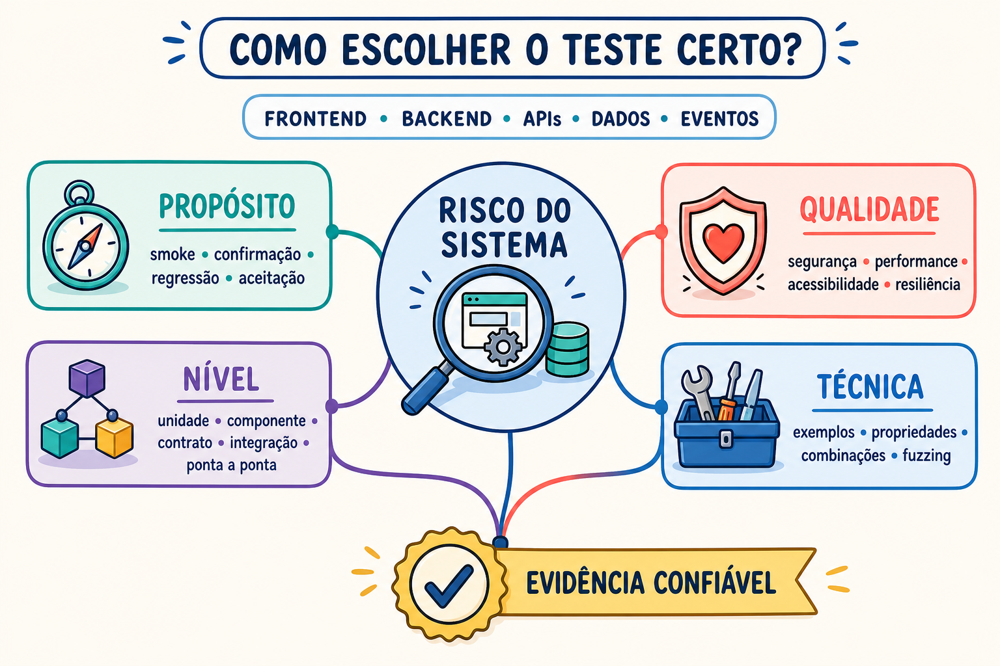

# Skill Suite Tests

[](https://github.com/andreferraro/skill-suite-tests/actions/workflows/quality.yml)
[](evals/results/v0.4.0-certification.json)
[](https://github.com/andreferraro/skill-suite-tests/releases/latest)
[](LICENSE)

Skill para orientar Codex e Cursor na criação de testes automatizados guiados por risco. Você informa a parte do sistema e o risco relevante. O agente inspeciona a stack, escolhe a menor fronteira capaz de provar o comportamento, implementa os testes, executa a suíte e relata evidências.

[Ver apresentação](https://docs.google.com/presentation/d/10icBAwszr-oIcf-SeNOB2QKGF9NQE1qs7TGqt0nVeQY/edit?usp=sharing)



## Comece em 2 minutos

Você precisa de Git e do Codex ou Cursor. Chaves de API e configuração no GitHub ficam fora do uso comum.

No terminal com o Codex CLI, adicione o catálogo do projeto:

```bash
codex plugin marketplace add andreferraro/skill-suite-tests --ref main
```

Reinicie o ChatGPT desktop, abra **Plugins Directory**, escolha o catálogo **Skill Suite Tests** e instale o plugin de mesmo nome. O marketplace do repositório é uma fonte Git para distribuição direta; ele ainda não faz parte do diretório público universal da OpenAI.

No Codex CLI ou IDE, também é possível instalar somente a skill:

```text
Use $skill-installer para instalar:
https://github.com/andreferraro/skill-suite-tests/tree/main/skills/skill-suite-tests
```

Depois, faça um pedido com alvo e risco:

```text
Use $skill-suite-tests no checkout. Cubra cálculo do total, idempotência do pagamento e rollback quando a persistência falhar.
```

No Cursor, abra **Customize > Rules > Add Rule > Remote Rule (GitHub)**, informe a URL do repositório e use:

```text
/skill-suite-tests Teste a recuperação de senha. Cubra loading, erro, teclado, acessibilidade e respostas assíncronas obsoletas.
```

Veja a [instalação detalhada](#instalação) e os [exemplos de uso](#como-usar).

## Como a skill prova que ajuda

A certificação é um experimento pareado. Baseline e tratamento recebem o mesmo agente, modelo, pedido, projeto e contrato de evidência. A única diferença é o uso explícito da skill. A release passa quando essa diferença produz testes melhores de forma repetível.

| Proteção | Critério aplicado |
| --- | --- |
| Comparação justa | Mesmo agente, modelo, pedido, fixture e schema nos dois modos |
| Avaliação cega | Riscos esperados, graders e mutantes ficam fora do workspace do agente |
| Sensibilidade real | Os testes passam na implementação correta e precisam detectar defeitos conhecidos |
| Segurança da mudança | Código de produção e manifests permanecem intactos |
| Evidência reproduzível | Comandos, resultados, riscos e limitações precisam formar um relatório válido |
| Repetibilidade | Três repetições por agente e caso, com aprovação crítica em pelo menos duas |
| Ganho comprovado | Mediana mínima de 85, ganho mínimo de 8 pontos e melhora em dois dos três casos por agente |
| Isolamento e custo | Contêiner descartável, graders ocultos e execução paga somente manual, com teto de chamadas |

Falhas individuais permanecem nos artefatos e participam da consolidação. Um baseline perfeito pode empatar em um caso, mas a release ainda precisa demonstrar ganho agregado sem regressão relevante.

Leia a [metodologia completa](evals/README.md#integridade-da-certificação) e consulte o [relatório auditável da v0.4.0](evals/results/v0.4.0-certification.json).

## Distribuição desde v0.5.0

A `v0.5.0` adota o formato instalável atual do ChatGPT e Codex:

- manifesto em `.codex-plugin/plugin.json`;
- catálogo Git em `.agents/plugins/marketplace.json`;
- runtime único em `skills/skill-suite-tests`;
- instalação portátil no Cursor pelo mesmo repositório.

Os arquivos executados pela skill mantêm o mesmo conteúdo certificado na `v0.4.0`. A mudança reorganiza o pacote e atualiza o instalador dos evals, sem alterar instruções, scripts, schema ou referências. Por isso, a certificação técnica continua identificada como `v0.4.0` até uma mudança funcional do runtime exigir nova rodada paga.

### Holdout em projeto open source

Além das fixtures controladas, o runtime incluído na `v0.4.0` foi aplicado ao hook de importação CSV do [Atomic CRM](https://github.com/marmelab/atomic-crm). Com o mesmo modelo, projeto, pedido e contrato, o mutation score passou de **60% no baseline para 80% com a skill**. O tratamento aprovou o gate técnico, preservou o código de produção e matou quatro dos cinco defeitos ocultos.

Consulte os [testes gerados, relatórios estruturados, comandos e resultados de cada mutação](evals/results/atomic-crm-holdout-2026-08-13/README.md). O holdout comprova ganho em uma execução real e complementa a certificação de três repetições da `v0.4.0`.

## Estado da v0.4.0

A versão `v0.4.0` fortalece testes de estados assíncronos, cancelamento, callbacks obsoletos e guards repetidos. Foi certificada no commit [`635c8e2`](https://github.com/andreferraro/skill-suite-tests/commit/635c8e24bb387745aea41573ba57d6724ea64bff) com Codex e Cursor, três repetições por caso e baselines equivalentes reaproveitados por fingerprint. O [relatório consolidado](evals/results/v0.4.0-certification.json) preserva as medianas, os gates, a falha individual e os links para todas as execuções.

| Evidência | Resultado |
| --- | --- |
| Projetos de referência | [3 implementados e aprovados](evals/results/fixture-validation.json) |
| Mutantes conhecidos | [12 implementados e 12 detectados](evals/results/fixture-validation.json) |
| Validação local dos scripts | 62 testes unitários aprovados |
| CI de qualidade | [Aprovada no Linux e Windows](https://github.com/andreferraro/skill-suite-tests/actions/workflows/quality.yml) |
| Certificação Codex | 3 repetições por caso, gate agregado aprovado |
| Certificação Cursor | 3 repetições por caso, gate agregado aprovado |
| Mediana da skill | 96,25/100 |
| Ganho mediano sobre baseline | 8,75 pontos |
| Certificação técnica | `v0.4.0`, aprovada em 13 de agosto de 2026 |
| Holdout open source | Atomic CRM: 60% no baseline e 80% com a skill |

### Baseline versus skill

| Agente | Caso | Baseline | Com a skill | Ganho |
| --- | --- | ---: | ---: | ---: |
| Codex | Pagamento | 87,5 | 96,25 | +8,75 |
| Codex | Consumidor de pedidos | 100 | 100 | 0 |
| Codex | Recuperação de senha | 27,5 | 96,25 | +68,75 |
| Cursor | Pagamento | 87,5 | 96,25 | +8,75 |
| Cursor | Consumidor de pedidos | 96,25 | 100 | +3,75 |
| Cursor | Recuperação de senha | 27,5 | 92,5 | +65 |

Os valores são medianas de três repetições por agente, caso e modo. A certificação exige aprovação crítica em pelo menos duas repetições. As falhas individuais continuam disponíveis nos artefatos dos runs e participam da mediana.

## O que esta skill é

- Um guia operacional para agentes com acesso ao código, terminal e ferramentas do projeto.
- Um processo de seleção de testes por risco, arquitetura, fronteira e oráculo.
- Uma matriz de rastreabilidade entre risco, mecanismo protetivo, estado, cenário e oráculo.
- Um pacote com detector de contexto, schema de evidência, validador e referências técnicas.
- Uma skill agnóstica no núcleo, com benchmark inicial em Web, API e eventos.

Framework de testes autônomo, runner e infraestrutura própria ficam fora do escopo. A skill reutiliza o que existe no projeto e pede uma decisão quando falta requisito, baseline, contrato ou ambiente autorizado.

## Suporte

| Status | Stack | Caso de referência |
| --- | --- | --- |
| Validado por fixture e mutações | React, TypeScript, Vitest, Testing Library e Playwright | Recuperação de senha |
| Validado por fixture e mutações | FastAPI, Python, pytest e SQLite | Criação de pagamento |
| Validado por fixture e mutações | Node.js, TypeScript, Vitest, RabbitMQ, PostgreSQL e Testcontainers | Consumidor de pedidos |
| Adaptável | Outros frameworks, linguagens e plataformas | Sem benchmark publicado |

O suporte validado cobre as três fixtures, os 12 mutantes, os evals pareados da `v0.4.0` e o holdout no Atomic CRM. Outros ecossistemas continuam como suporte adaptável, sem benchmark publicado.

## O que pode ser testado

- Frontend: componentes, telas, navegação, estado, teclado, acessibilidade e comportamento visual.
- Backend: regras de domínio, serviços, jobs, banco, cache, transações e concorrência.
- APIs: HTTP, REST, GraphQL, gRPC, contratos, protocolo e versionamento.
- Integrações: webhooks, filas, eventos, retries, DLQ, ordering e idempotência.
- Jornadas: interface, serviços, dados e efeitos observáveis de ponta a ponta.
- Qualidade: segurança, performance, resiliência, observabilidade e experiência.

A classificação usa quatro eixos:

| Eixo | Pergunta | Exemplos |
| --- | --- | --- |
| Propósito | Por que testar? | smoke, confirmação, regressão, aceitação |
| Nível | Onde observar? | unidade, componente, contrato, integração, ponta a ponta |
| Qualidade | Qual risco medir? | funcional, segurança, performance, acessibilidade, resiliência |
| Técnica | Como gerar os casos? | limites, tabela de decisão, property-based, combinatório, fuzz |

Em fluxos assíncronos, a skill separa estados que possuem proteções diferentes. Cancelamento durante parsing, processamento ou espera entre lotes vira cenários distintos quando cada fase pode falhar de uma forma própria. O teste confirma o estado cancelado antes de liberar callbacks obsoletos, usando payload capaz de causar um efeito proibido caso o guard falhe. Erros fatais e erros parciais retornados com os dados também recebem oráculos distintos. A prova de sensibilidade remove temporariamente cada proteção relevante e confirma que o cenário correspondente detecta a falha.

## Instalação

Instalar e usar a skill no Codex ou no Cursor não exige `OPENAI_API_KEY`, `CURSOR_API_KEY` nem configuração no GitHub. Essas credenciais pertencem somente aos benchmarks automatizados mantidos neste repositório.

O repositório segue os formatos atuais de distribuição: plugin para ChatGPT e Codex, skill portátil para Cursor e instalação local pelo Skill Installer.

O plugin está disponível pelo marketplace Git deste repositório. A publicação no diretório público da OpenAI exige submissão e verificação do desenvolvedor em uma etapa separada.

### ChatGPT desktop e Codex como plugin

Adicione o marketplace pelo Codex CLI:

```bash
codex plugin marketplace add andreferraro/skill-suite-tests --ref main
```

Depois:

1. Reinicie o ChatGPT desktop.
2. Abra **Plugins Directory**.
3. Selecione o catálogo **Skill Suite Tests**.
4. Instale o plugin **Skill Suite Tests**.

O plugin distribui a skill que está em `skills/skill-suite-tests`. Ele não possui MCP, serviço externo nem autenticação própria. Marketplaces de repositório são voltados a autoria, teste e distribuição direta; a disponibilidade pode variar entre as superfícies do ChatGPT e do Codex.

Para receber versões novas do catálogo:

```bash
codex plugin marketplace upgrade skill-suite-tests
```

### Codex CLI ou IDE com Skill Installer

Envie:

```text
Use $skill-installer para instalar:
https://github.com/andreferraro/skill-suite-tests/tree/main/skills/skill-suite-tests
```

Esse modo instala apenas o runtime da skill em `~/.codex/skills/skill-suite-tests`.

### Cursor pela interface

1. Abra **Customize**.
2. Entre em **Rules** e clique em **Add Rule**.
3. Selecione **Remote Rule (GitHub)**.
4. Informe `https://github.com/andreferraro/skill-suite-tests`.
5. Confira `skill-suite-tests` em **Customize > Skills**.

### Conferência

No Codex CLI ou IDE:

```text
/skills
```

No Cursor, abra **Customize > Skills**. Nos dois casos, procure por `skill-suite-tests`.

Codex detecta skills instaladas automaticamente. Se ela ainda estiver ausente, reinicie a ferramenta.

## Como usar

No Codex, mencione a skill com `$`:

```text
Use $skill-suite-tests na criação de pagamentos. Prove idempotência sob chamadas concorrentes e rollback após falha no insert.
```

No Cursor, selecione a skill com `/`:

```text
/skill-suite-tests Teste a recuperação de senha. Cubra loading, anúncio de erro, teclado, acessibilidade e respostas assíncronas obsoletas.
```

O pedido funciona melhor com estas informações:

1. Alvo: tela, componente, endpoint, serviço, job, evento ou jornada.
2. Comportamento: regra, critério de aceite, contrato ou bug conhecido.
3. Risco: falha e impacto que precisam ser detectados.
4. Ambiente: local, CI, staging, browser, banco ou broker disponível.
5. Restrições: dados, serviços externos, carga, duração e permissões.
6. Entrega: criar, executar, diagnosticar ou preparar os testes.

Exemplo para uma jornada:

```text
Use $skill-suite-tests no checkout. Cubra UI, API, persistência, evento de pedido criado e confirmação ao cliente. Reutilize a stack atual e execute o conjunto mínimo capaz de provar esses riscos.
```

Exemplo para performance:

```text
Use $skill-suite-tests na busca. Prepare smoke, carga e pico. Marque thresholds ausentes como <definir> e execute somente no ambiente autorizado.
```

## Entrega do agente

A resposta humana apresenta:

- suporte validado ou adaptável;
- classificação nos quatro eixos;
- base de teste e riscos rastreáveis;
- fronteiras, cenários, dados e oráculos;
- arquivos alterados;
- comandos executados e resultados;
- prova de sensibilidade;
- limitações e itens `<definir>`.

Automações também podem exigir `test-evidence.json`. O contrato está em [`skills/skill-suite-tests/schemas/test-evidence.v1.json`](skills/skill-suite-tests/schemas/test-evidence.v1.json) e há um [`exemplo validado`](skills/skill-suite-tests/examples/test-evidence.example.json).

```bash
python skills/skill-suite-tests/scripts/validate_test_evidence.py test-evidence.json
```

## Credenciais e custo

O uso comum acontece dentro do Codex ou do Cursor instalado pelo usuário e segue o plano ou provedor configurado nessa ferramenta.

Os secrets `OPENAI_API_KEY` e `CURSOR_API_KEY` aparecem apenas nos benchmarks de manutenção. Quem instala a skill para testar um sistema não precisa cadastrar esses secrets.

Os benchmarks pagos nunca são acionados por push, pull request, merge ou release. A execução exige abertura manual do workflow, escolha do escopo, confirmação do teto de chamadas e autorização explícita. Com a autorização desmarcada, o workflow mostra o plano e encerra sem chamar agentes. O runner também rejeita a execução sem `--max-agent-calls`.

| Execução manual | Teto sem cache | Com todos os baselines válidos em cache |
| --- | ---: | ---: |
| Codex, um caso, uma repetição | 2 chamadas | 1 chamada |
| Codex, três casos, uma repetição | 6 chamadas | 3 chamadas |
| Codex e Cursor, três casos, uma repetição | 12 chamadas | 6 chamadas |
| Codex e Cursor, três casos, três repetições | 36 chamadas | 18 chamadas |

Uma chamada não tem preço fixo. O valor depende do modelo e dos tokens processados. O teto controla a quantidade de chamadas e evita execuções acidentais; o consumo em moeda deve ser acompanhado nos provedores.

## Evals

Os evals comparam o mesmo agente, projeto e pedido em dois modos: baseline sem a skill e tratamento com invocação explícita. Os dois modos recebem o mesmo schema e validador do relatório, evitando vantagem artificial de formato. Os testes gerados precisam passar na implementação correta, detectar os mutantes, cobrir os riscos, preservar produção e manifests e gerar evidência válida. O gate também rejeita agente, caso, modo ou repetição ausente ou duplicada.

Consulte [`evals/README.md`](evals/README.md) para casos, mutações, pontuação, comandos e gates.

Validação determinística local:

```bash
python -m unittest discover -s tests -v
python scripts/validate_repository.py
python evals/validate_fixtures.py
```

Essa validação não usa agentes nem consome créditos de API.

## Estrutura

- [`.codex-plugin/plugin.json`](.codex-plugin/plugin.json): identidade e metadados do plugin.
- [`.agents/plugins/marketplace.json`](.agents/plugins/marketplace.json): catálogo instalável pelo repositório.
- [`skills/skill-suite-tests/`](skills/skill-suite-tests): fonte única do runtime distribuído.
- [`skills/skill-suite-tests/SKILL.md`](skills/skill-suite-tests/SKILL.md): contrato e fluxo do agente.
- [`skills/skill-suite-tests/scripts/`](skills/skill-suite-tests/scripts): detectores, validação de evidência e prova de sensibilidade.
- [`skills/skill-suite-tests/schemas/test-evidence.v1.json`](skills/skill-suite-tests/schemas/test-evidence.v1.json): contrato JSON Schema.
- [`skills/skill-suite-tests/references/`](skills/skill-suite-tests/references): taxonomia, oráculos, ecossistemas e bases técnicas.
- [`evals/`](evals): fixtures, graders, mutantes, runner e agregador.
- [`tests/`](tests): testes unitários dos scripts e do harness.

## Segurança operacional

- Credenciais dos benchmarks entram somente por variáveis de ambiente ou GitHub Actions secrets.
- O runner remove tokens e credenciais alheias antes de iniciar agentes.
- Cada execução usa um contêiner descartável com raiz somente leitura.
- O agente recebe somente a fixture e um home temporário. Graders, mutantes, repositório e credenciais de produção ficam fora do contêiner.
- Carga, estresse, fuzz externo e injeção de falhas exigem ambiente autorizado.
- Cleanup fica restrito aos recursos criados pelo teste.

## Contribuição e release

Leia o [guia de contribuição](CONTRIBUTING.md), a [política de segurança](SECURITY.md) e o [código de conduta](CODE_OF_CONDUCT.md) antes de abrir uma contribuição.

O repositório usa Gitflow:

- `main`: versões publicadas.
- `develop`: integração.
- `feature/*`: mudanças em desenvolvimento.
- `release/*`: preparação da versão.
- `hotfix/*`: correções originadas de `main`.

Commits seguem Conventional Commits. Uma release que altera o runtime exige qualidade estrutural, fixtures verdes e aprovação manual do benchmark com Codex e Cursor. Uma release restrita a empacotamento ou documentação pode reutilizar a certificação anterior somente quando a equivalência do runtime for validada e registrada.

As branches estão protegidas no GitHub:

- `develop` exige pull request atualizado, checks de qualidade e conversas resolvidas;
- `main` exige os mesmos controles de qualidade;
- as regras também valem para administradores e bloqueiam force push e exclusão das branches.

Os evals pagos ficaram fora dos checks automáticos obrigatórios. O gate de eficácia continua sendo critério de publicação da versão, executado uma única vez quando a release estiver pronta.

### Certificação da v0.4.0

Configuração atual em **Settings > Secrets and variables > Actions**:

| Tipo | Nome | Estado |
| --- | --- | --- |
| Secret | `OPENAI_API_KEY` | Validado na certificação Codex |
| Secret | `CURSOR_API_KEY` | Validado na certificação Cursor |
| Variable | `CODEX_EVAL_MODEL` | Validada na certificação Codex |
| Variable | `CURSOR_EVAL_MODEL` | Validada na certificação Cursor |

As chaves devem ser cadastradas diretamente no GitHub. Evite colocá-las em arquivos, comandos com valor literal, commits ou mensagens do PR.

Execuções que compõem a certificação:

- Codex: [repetição 1](https://github.com/andreferraro/skill-suite-tests/actions/runs/31742296719), [repetição 2](https://github.com/andreferraro/skill-suite-tests/actions/runs/31743290197) e [repetição 3](https://github.com/andreferraro/skill-suite-tests/actions/runs/31744307025).
- Cursor: [repetição 1](https://github.com/andreferraro/skill-suite-tests/actions/runs/31742301749), [repetição 2](https://github.com/andreferraro/skill-suite-tests/actions/runs/31743295147) e [repetição 3](https://github.com/andreferraro/skill-suite-tests/actions/runs/31744312140).

Os tratamentos foram executados no commit certificado e consolidados pelo mesmo agregador usado no gate de release. Os baselines foram restaurados por fingerprint a partir de execuções equivalentes. A falha individual do Codex em Web na terceira repetição foi preservada e contou na mediana. Repetir a certificação exige uma nova decisão explícita de custo. Os critérios e os tetos de chamadas estão em [`evals/README.md`](evals/README.md).

## Referências

- [Skills no ChatGPT e Codex](https://learn.chatgpt.com/docs/build-skills)
- [Empacotamento e marketplaces de plugins](https://developers.openai.com/plugins/build/plugins)
- [Codex em modo não interativo](https://learn.chatgpt.com/docs/non-interactive-mode)
- [Agent Skills no Cursor](https://cursor.com/docs/skills)
- [Cursor CLI em modo headless](https://cursor.com/docs/cli/headless)
- [Apresentação da Skill Suite Tests](https://docs.google.com/presentation/d/10icBAwszr-oIcf-SeNOB2QKGF9NQE1qs7TGqt0nVeQY/edit?usp=sharing)
